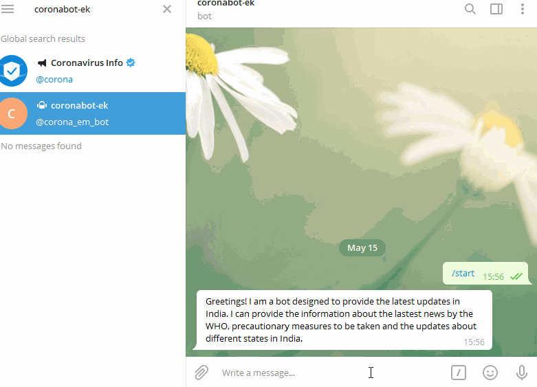

# 🤖 Corona-Bot built with Rasa X

## Introduction
This is a Rasa chatbot which helps obtaining live covid19 updates.

Currently the bot supports the following user goals:

* Updates of the active, recovered, confirmed and deaths in different states of India.
* Provides precautionary measures to be taken during the pandemic.
* Provides links to the latest news updates by WHO.


## 📱 How to get these updates on your mobile
#### Step 1: Install telegram
#### Step 2: search for coronabot-ek
#### Step 3: Talk to the bot for updates





## ⚙️ How to set up Rasa

#### Step 1
**Create a virtual environment and activate it**
```
conda create --name rasa_test python=3.7
conda activate rasa_test
```

#### Step 2
**Install rasa**
```
pip install rasa==1.10.0
```

#### Step 3
**Run actions.py on one terminal in conda env**
```
rasa run actions
```

#### Step 4
**Run the rasa shell to chat with the bot**
```
rasa shell
```

## Task List
- [x] Updates about states in India
- [x] Precautionary measures to be taken.
- [x] News updates
- [ ] Information about red, green zones
- [ ] Answers in the form of images, gifs
- [ ] Updates about cities, countries
- [ ] Making it more interactive.


## 👨🏼‍💻 Collaborators
**[Elita Menezes](https://github.com/ELITA04)**

**[Kevlyn Kadamala](https://github.com/kad99kev)**

